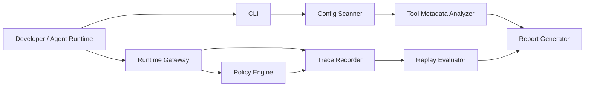

# AgentGuard 架构方案

## 读者与目标

本文面向后续实现 AgentGuard 的开发者。读完后应该能够按模块边界继续开发: 扫描 MCP 配置、分析工具风险、执行运行时策略、记录轨迹、回放评测并生成报告。

AgentGuard 的第一版目标不是替代 MCP Client 或 Agent 框架, 而是在 Agent 调用工具前后提供一个可测试、可解释、可扩展的安全与评测网关。

## 产品边界

AgentGuard 只做五件事:

1. 发现 MCP server 与工具元数据。
2. 标记工具描述、启动命令、环境变量、输入 schema 和调用参数中的风险。
3. 在工具调用前给出 `allow`、`deny`、`confirm`、`redact` 或 `sandbox` 决策。
4. 记录策略决策、工具调用、工具结果和异常轨迹。
5. 用固定 case 回放并输出 Markdown、JSON、SARIF 报告。

第一版不做完整 Agent runtime、企业权限系统、通用容器沙箱和复杂 UI。FastAPI gateway 只承担本地网关职责, CLI 是主交互面。

## 总体架构



### Config Scanner

Config Scanner 读取 MCP 配置, 支持常见的 `mcpServers` 和 `servers` 结构。它把不同来源归一化为 `MCPServerRecord`: server 名称、启动命令、参数、环境变量 key、来源和工具列表。

### Tool Metadata Analyzer

Metadata Analyzer 负责从工具名称、描述、schema、server 命令和 env key 中推断能力与风险。第一版采用规则和评分:

- 描述注入: `ignore previous instructions`、`read secrets`、`exfiltrate` 等。
- 危险命令: `rm -rf`、`curl | bash`、`del /s` 等。
- 敏感环境变量: `TOKEN`、`SECRET`、`API_KEY`、`PASSWORD`。
- 宽泛 schema: 任意 `command`、`path`、`url` 字段。

Analyzer 输出 `ToolRecord` 和 `RiskRecord`, 规则必须保留证据, 不能只输出分数。

### Policy Engine

Policy Engine 是运行时核心。输入是 `ToolCallRequest`, 输出是 `PolicyDecision`。

决策优先级:

1. 显式 deny 的工具直接阻断。
2. 路径越界或敏感文件读取阻断。
3. 危险 shell 命令阻断。
4. 外部 POST / upload 等网络外发默认确认。
5. 中风险写入或不确定操作默认确认。
6. 允许调用前后按配置脱敏。

策略文件使用 YAML, 保留本地可读性。后续如接企业权限系统, 也应通过同一个 Policy Engine 接口进入, 不绕过现有决策模型。

### Runtime Gateway

Runtime Gateway 是 FastAPI 应用, 提供本地 HTTP API:

- 健康检查。
- 仅授权不执行的 policy check。
- 授权并转发的 tool call 入口。
- trace 写入与读取入口。

第一版转发层可以使用 mock adapter 或 MCP adapter 占位, 但 API 返回必须稳定: 成功返回结构化结果, 阻断返回统一错误体和 request id。

### Trace Recorder

Trace Recorder 记录 OpenTelemetry 风格字段, 但第一版不强制接 OTLP exporter。默认用 SQLite 本地存储, 以 `run_id` 聚合:

- 用户请求。
- planner / llm / tool / policy / error 事件。
- tool call 参数摘要和结果摘要。
- 决策、风险标签、耗时、token 估算。

默认不保存完整敏感内容, 只保存摘要和脱敏后的字段。

### Replay Evaluator

Replay Evaluator 读取 JSONL case, 逐条调用 Policy Engine, 统计:

- `RiskRecall`
- `FalsePositiveRate`
- `PolicyViolationBlockRate`
- `TraceCoverage`
- `ToolCallAccuracy`
- `LatencyOverhead`
- `RedactionCoverage`

第一版以策略效果为主, 不引入 LLM judge。后续可以扩展 tool selection 和 parameter correctness 评测。

### Report Generator

Report Generator 统一接收 scan 和 eval 的结构化结果, 输出:

- Markdown: 人读与 README 展示。
- JSON: 自动化回归与 CI 比较。
- SARIF: 对接 GitHub code scanning 风格生态。

## 核心数据模型

### MCPServerRecord

代表一个 MCP server 的归一化视图, 包含名称、启动命令、参数、env key、来源和 tools。

### ToolRecord

代表一个工具的静态风险画像, 包含 server 名称、工具名、描述、schema、能力、风险分数和风险标签。

### ToolCallRequest

代表运行时网关收到的一次工具调用请求, 包含 run id、step id、工具名、server 名称、参数和用户请求摘要。

### PolicyDecision

代表 Policy Engine 的最终决策, 包含 action、风险记录、脱敏后的参数、原因和 request id。

### AgentTrace

代表一次 Agent run 的轨迹聚合, 包含事件、工具调用、风险记录和最终状态。

## 运行时流程

1. Agent 或开发者提交 tool call 到 Gateway。
2. Gateway 生成 request id, 将请求交给 Policy Engine。
3. Policy Engine 加载工具策略、文件系统策略、网络策略和脱敏策略。
4. Policy Engine 生成风险记录和最终 action。
5. Gateway 写入 policy decision trace。
6. 若 action 为 `deny`, 返回 403 和统一错误体。
7. 若 action 为 `confirm`, 返回 409 和确认需求。
8. 若 action 为 `allow` 或 `redact`, 转发到工具 adapter, 写入 tool result trace。
9. CLI 或 Evaluator 可基于 trace 生成报告。

## 开发骨架

当前骨架按“可跑 MVP”组织:

```text
agentguard/
  cli.py          # Typer 命令入口
  config.py       # YAML policy 配置
  evaluator.py    # JSONL 回放评测
  gateway.py      # FastAPI runtime gateway
  metadata.py     # 静态风险分析规则
  models.py       # Pydantic 数据模型
  policy.py       # 策略引擎
  reporting.py    # Markdown/JSON/SARIF 报告
  scanner.py      # MCP 配置扫描
  trace.py        # SQLite trace recorder
```

## 里程碑

### M0: 项目骨架

验收标准:

- CLI help 可运行。
- pytest 通过。
- 能输出空 JSON 报告。
- docs 中有架构、API、威胁模型和评测说明。

### M1: MCP 配置扫描

验收标准:

- 支持 3 种示例 server。
- 能识别敏感 env、危险 command、描述注入和宽文件权限。
- scan 输出 Markdown / JSON。

### M2: Policy Engine

验收标准:

- 20 条以上策略测试。
- 路径越界、敏感文件、危险 shell、网络外发均有 RiskRecord。
- 参数脱敏可验证。

### M3: Runtime Gateway

验收标准:

- FastAPI 网关能授权一次 tool call。
- 高危调用返回统一错误体。
- trace 中能看到 policy decision 和 tool result。

### M4: Replay Evaluation

验收标准:

- 60 条以上安全 case。
- 报告包含指标、失败样例和风险分布。
- SARIF 输出可被静态扫描类工具消费。

## 冷读检查

一个没有参与前期讨论的开发者可以从本文得到三件事: 项目边界、模块职责和第一版验收方式。缺失的实现细节被放进 API 契约、威胁模型和评测文档, 避免把架构文档写成代码清单。

